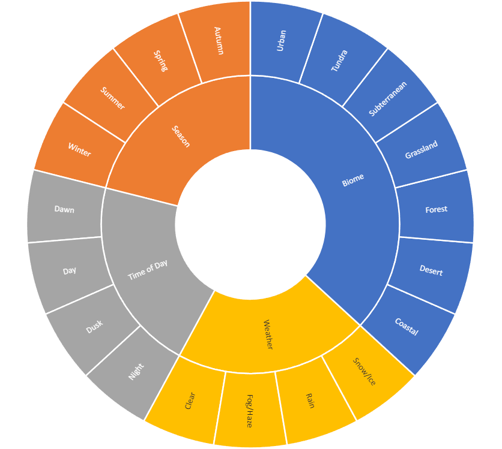
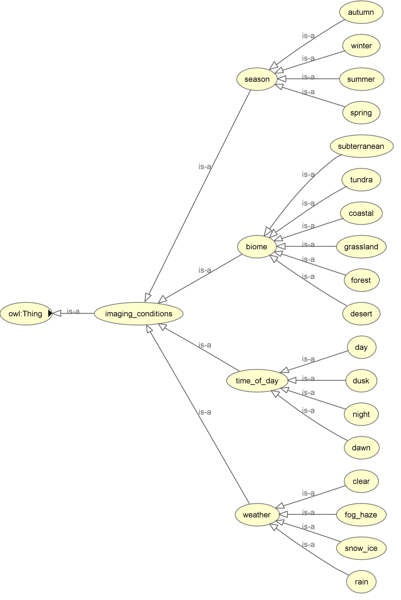
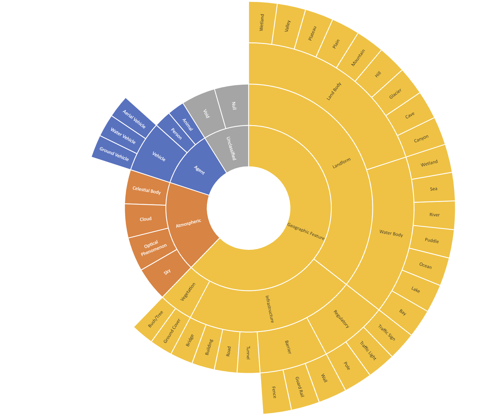
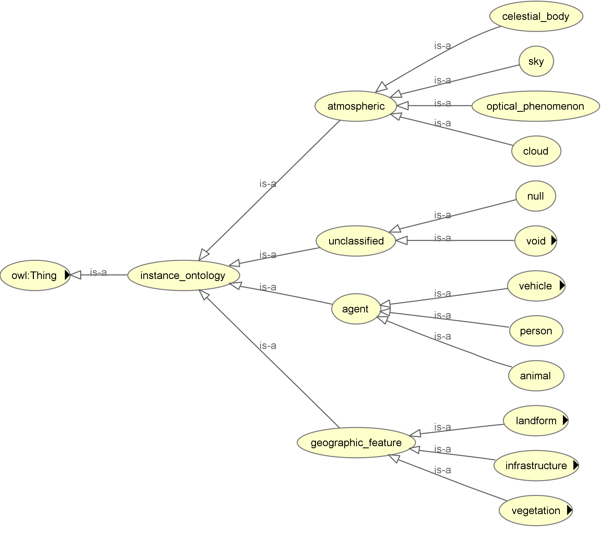
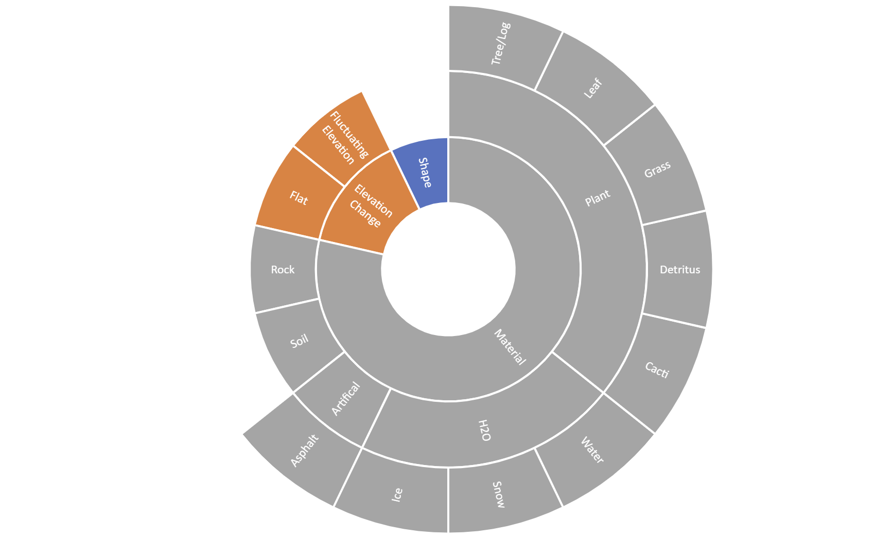
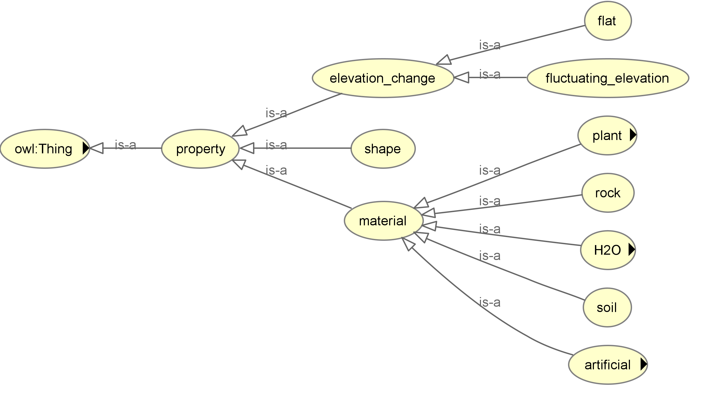

# ORATOR-ATLAS
This repo holds the relevant code for an All-Terrain Labelset for Autonomous Systems (ATLAS) developed by the Off-Road Annotation TOols & Resources (ORATOR) team and Texas A&M Univsity. The goal of this effort is to develop a standardized ontology for off-road datasets to unify exisiting and future dataset ontologies. This standardized ontological framework can be used to aid training AI-models on data that is collected from multiple datasets. Moreover, the integration of W3C Web Ontology Language (OWL) allows for easy addition to the proposed ontology and the ability to analyze data for inconsistencies. 

There are 3 different parts of the ontology - instance ontology, imaging conditions, and properties. The imaging conditions typically apply to an entire dataset, whereas the instance onotology corresponds to objects within a single image. The different objects can have associated properties. Overviews are shown for the different parts below within the OWL framework. There are  changes from the original ATLAS version that was previously published and viewable in the manuscript in this repo. 

The below image shows the high level view of the Imaging Conditions and corresponding OWL representation. 

The below image shows the high level view of the instance ontology and corresponding OWL representation. 

The below image shows the high level view of the properties and corresponding OWL representation. 

## Supported Datasets 
The mappings from current datasets to ATLAS has been created for:

- [A2D2](https://www.a2d2.audi/a2d2/en/download.html)
- [DeepScene (Freiburg Forest)](http://deepscene.cs.uni-freiburg.de/)
- [RELLIS3D](https://github.com/unmannedlab/RELLIS-3D)
- [RUGD](http://rugd.vision/)
- [YCOR](https://theairlab.org/yamaha-offroad-dataset/)

The converted datasets are available upon request. 

## Installation 

The installation dependencies are divided into relevant parts. This is to reflect the different parts of the proposed pipeline. 

The installation instructions assume that the development platform is Ubuntu 20.04. 

### Dependencies for SemanticImage

SemanticImage relies on 2 dependencies - OpenCV and jsoncpp. Jsoncpp and CMake can be installed with the below command: 

`sudo apt-get install cmake libjsoncpp-dev libboost-all-dev -y`

#### Install  OpenCV:
The process for installing the most recent version of OpenCV with the contrib modules is:

`cd ~`

`mkdir opencv_build`

`cd opencv_build`

`wget -O opencv.zip https://github.com/opencv/opencv/archive/4.x.zip`

`wget -O opencv_contrib.zip https://github.com/opencv/opencv_contrib/archive/4.x.zip`

`unzip opencv.zip`

`unzip opencv_contrib.zip`

`mkdir -p build && cd build`

`cmake -DOPENCV_ENABLE_NONFREE:BOOL=ON  -DOPENCV_EXTRA_MODULES_PATH=/home/$USER/opencv_build/opencv_contrib-4.x/modules /home/$USER/opencv_build/opencv-4.x/     -D OPENCV_GENERATE_PKGCONFIG=ON `

`make -j$(nproc)`

`sudo make install`

### Dependencies for OntologyInstantiation

The dependencies for OnotologyInstantiation can be installed by the below command:

`sudo apt install python3-pip  `

` pip install owlready2 numpy matplotlib `

### W3C Web Ontology Language (OWL) - Protege

OWL is used to represent the ontology in a hierarchical manner and leverage open-source packages for analyzing and modifying ATLAS. OWL allows us to take ATLAS one step further from the previous version and allow objects to have the ability to have multiple parents and assign properties to individual objects. This facilitates the addition of context to images and objects. Moreover, there are tools that can be used to determine if labellers assign inconsistent labels or properties to an object.

The recommended software package to use is Protege. The link to Protege can be found [here](https://protege.stanford.edu/). It is recommended to install Protege  Desktop. This application allows for viewing and modifying the onotology. 

The onotology can be loaded into the software by File->Open and then selecting the relevant "***.owl" file. 

## SemanticImage 
This package is used to start the conversion of existing semantically segmented datasets into a more standarized format. The input to this step is a semantically segmented image and a json file containing the RGB value and corresponding semantic class. The output file contains the necessary information for input into OntologyInstantiation, such as the input image, ATLAS version, object class, object size, and polygon vertices.

### Parameters: 

**ATLAS_version** - This is the current version of ATLAS being used. The default is "2.1.2". This is one of the items included in the json file. 

**ext** - This is the extension of the image files being analyzed. 

**input_directory** - This is the name of the input image directory for analysis. 

**input_json** - This input json should contain the semantic class and corresponding RGB value for the dataset being analyzed. 

**min_polygon_area** - This is the minimum number of pixels that a contour needs or else it is filtered out and not outputted to the output json file. 

**num_threads** - This is the number of threads that can be used to help speed up processing times. The default is to use all threads on the machine. 

**output_directory** - The output json directory is the name of the directory that files are to be written after analysis. 

**visualize** - This is a variable to see the images that are being processed.  It will display the input image, the detected edges, and the extracted contours that are written to the output json file. This default is set to false, since it slows down processing times. 

### Usage
Make sure to adjust the parameters to match your setup. Make sure you are in the main directory for the ORATOR-ATLAS repo. After the code can be built and run by the following commands in the terminal:

`cd SemanticImage`

`mkdir build`

`cd build`

`cmake ..`

`make`

`./main`

After the initial time, the code only needs to be rebuilt after changes are made to the the corresponding files. The code can be rebuilt by the following command. Make sure that you are in the build directory for this SemanticImage. 

`make`

After the code is built, the code can be run by the following command. Make sure that you are in the build directory for SemanticImage. 

`./main`

## OntologyInstantiation 

This package is used to take the json file from SemanticImage and convert it to a unified ATLAS ontology. 

### Parameters

**input_ATLAS_ontology** - This is the OWL file for the ATLAS version being used. 

**input_image_json_directory** - This is the output file directory from SemanticImage that is the input to this package. It contains the information about the images being analyzed.  

**input_ontology_mapping** - This is a json file that converts the semantic classes from an existing dataset into the ATLAS ontology. 

**output_owl_directory** - This is the output file directory for the converted OWL files from the inputted image json files. 

### Usage 

From the OntologyInstantiation directory, the code can be run with:

`python3 main.py`

## Acknowledgements
This work is a collaboration between USARMY GVSC and TAMU. 

## TO-DO
- Update readme for changes
- Update list of supported datasets
- Example integration showing the distribution of objects/images for single dataset and multidataset
- Example integration showing the images from different datasets in a unified ontology
- Reorganize and cleanup repo 
- What is .idea folder in Ontology Instantiation
- What are the 2 Rellis3D owl mappings 
- RGB color mappings for datasets
- Be able to take in 0-N Greyscale images rather than RGB
- [CityScapes](https://github.com/NVIDIA/semantic-segmentation/blob/main/datasets/cityscapes_labels.py) color scheme, note that some rgb colors are repeated for some classes