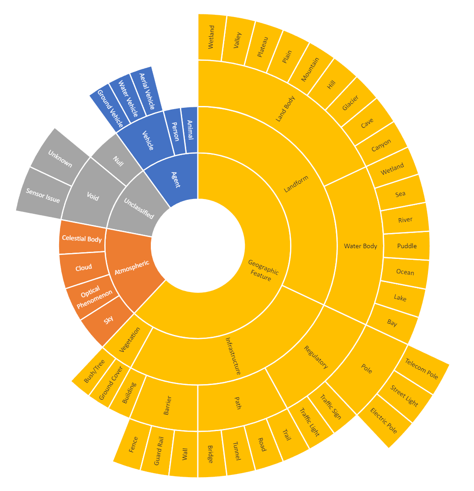
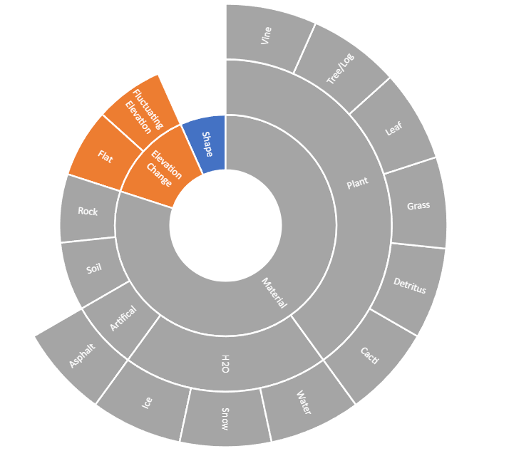

# ORATOR-ATLAS
**Note:**  This is a current work in progress and is currently under development. 

This repo holds the relevant code for an All-Terrain Labelset for Autonomous Systems (ATLAS) developed by the Off-Road Annotation TOols & Resources (ORATOR) team and Texas A&M University. The goal of this effort is to develop a standardized ontology for visual datasets to unify existing and future dataset ontologies. This standardized ontological framework can be used to aid training AI-models on data that is collected from multiple datasets. Moreover, the integration of W3C Web Ontology Language (OWL) allows for easy addition to the proposed ontology and the ability to analyze data for inconsistencies through open-source reasoners. This allows users to adapt the ontology to meet their needs.  

There are 5 different class parents of the ontology - collection platform, instance attibutes, instance labels, scenario label, and sensor. There are also associated data properties and object properties. Since there is a large number of classes, it is recommended to use Protege to view the ontology. Additional classes can be added to the ontology as needed. Please subnmmit a pull request if you would like to add additional classes to the ontology.

The proposed ontology can be used to help guide the creation of an ontology for a new dataset or be used to understand the relationships between the different classes for intelligent reasoning. 

<!-- image labels, instance labels, instance attributes, and properties.  -->

<!-- - Image Labels - Imaging conditions that describe the environment 
- Instance Labels - High-level descriptions of objects in an image. 
- Instance Attributes - Typically sub-masks for image labels, since they define  entities at a low-level. 
- Properties - Further define the instances. 
    - Data Properties - Define and quantify unique characteristics of an individual. 
        - ConfidenceLevel - Associated with the detection of an entity and the confidence value in its detection.
        - ElevationChange - Goes with the corresponding instance attribute to define how much elevation change is present. Positive values correspond to an increase in elevation and negative values correspond to a decrease in elevation.
        - ImageDataset - Used to assign the name of the dataset from where the image originates.
        - ImageName - Used as a reference to the corresponding image.
        - IsAdversary - Specifies whether an agent is an enemy or friendly.
        - IsBoulder - Denotes the boulders in the image, since it may be hard to distinguish the size of rocks using the size property. The size property is designed to be used to mark the entire area that corresponds to boulders.
        - IsFreshWater - Differentiates saltwater from fresh water and should be used in conjunction with a H20 material from instance properties.
        - IsGravel - Identify gravel in the image, since it may be hard to distinguish the size of rocks using the size property. The size property is designed to be used to denote the entire area that corresponds to gravel.
        - IsShadow - Signifies if a shadow is present for the detected entity.
        - SensorIssue - Specifies what type of sensor issue is present. This can include decalibrations, lens flares, loss of focus, and degraded sensor capabilities, etc.
        - Size - Currently, this is being used to denote the number of pixels in the image that makes up the corresponding instance. This can also be used for physical units such as $m^2$.
        - Traversability - Specifies the ease for an agent to traverse the corresponding entity. A higher value is associated with higher cost to traverse.
        - Version - Used to denote the ATLAS version being used to instantiate the ontology.
    - Object Properties - Define the relationship between two objects. For example, it can be used to assign instance attributes to the instance labels. 
        - HasMaterial - Defines what material makes up an entity, for example, a trail in an image can be made up of soil, or a geographic feature can be made up of grass.
        - Makes - This is the inverse property of HasMaterial. It specifies what all individuals in an image are made up of by a specific material. For example, soil can be the material for two unique individuals in an image like a trail and a geographic feature.

Visual representations of parts of the ontology can be seen below. They can also be viewed in Protege, for a more accurate representation of the hierarchies.  -->

<!-- 

## **Image Labels**

## **Instance Labels**

## **Instance Attributes**

 -->

## Supported Datasets 
The mappings from current datasets to ATLAS has been created for:

- [A2D2](https://www.a2d2.audi/a2d2/en/download.html)
- [DeepScene (Freiburg Forest)](http://deepscene.cs.uni-freiburg.de/)
- [RELLIS3D](https://github.com/unmannedlab/RELLIS-3D)
- [RUGD](http://rugd.vision/)
- [YCOR](https://theairlab.org/yamaha-offroad-dataset/)

The converted datasets are available upon request or can be created using this package. 

## Installation 

The installation dependencies are divided into relevant parts. This is to reflect the different parts of the proposed pipeline. 

The installation instructions assume that the development platform is Ubuntu 20.04. 

### Dependencies for SemanticImage

SemanticImage relies on 2 dependencies - OpenCV and jsoncpp. Jsoncpp and CMake can be installed with the below command: 

`sudo apt-get install cmake libjsoncpp-dev libboost-all-dev -y`

#### Install  OpenCV:
The process for installing the most recent version of OpenCV with the contrib modules is:

`cd ~`

`mkdir opencv_build`

`cd opencv_build`

`wget -O opencv.zip https://github.com/opencv/opencv/archive/4.x.zip`

`wget -O opencv_contrib.zip https://github.com/opencv/opencv_contrib/archive/4.x.zip`

`unzip opencv.zip`

`unzip opencv_contrib.zip`

`mkdir -p build && cd build`

`cmake -DOPENCV_ENABLE_NONFREE:BOOL=ON  -DOPENCV_EXTRA_MODULES_PATH=/home/$USER/opencv_build/opencv_contrib-4.x/modules /home/$USER/opencv_build/opencv-4.x/     -D OPENCV_GENERATE_PKGCONFIG=ON `

`make -j$(nproc)`

`sudo make install`

### Dependencies for OntologyInstantiation

The dependencies for OnotologyInstantiation can be installed by the below command:

`sudo apt install python3-pip  `

` pip install owlready2 numpy matplotlib `

### W3C Web Ontology Language (OWL) - Protege

OWL is used to represent the ontology in a hierarchical manner, leverage open-source reasoners, analyze images, and modify the proposed ontology to meet the needs of the user. OWL allows objects to have improved annotation capabilities, compared to traditional methods of classes associated with specific RGB values for images or json-based annotation methods. The proposed framework allows multiple labels and properties to be assigned to a single object and for complex ontologies to be developed. This facilitates the addition of context to images and objects. Moreover, there are tools that can be used to determine if labelers assign inconsistent labels or properties to an object.

The recommended software package to use is Protege. The link to Protege can be found [here](https://protege.stanford.edu/). It is recommended to install Protege Desktop. This application allows for viewing and modifying the ontology, as well as the creation and reasoning of created rules. 

The onotology can be loaded into the software by File->Open and then selecting the relevant "***.owl" file. 

## SemanticImage 
This package is used to start the conversion of existing semantically segmented datasets into a more standardized format. The input to this step is a semantically segmented image and a json file containing the RGB value and corresponding semantic class. The output file contains the necessary information for input into OntologyInstantiation, such as the input image, ATLAS version, object class, object size, and polygon vertices.

### Parameters: 

**ATLAS_version** - This is the current version of ATLAS being used. This is one of the items included in the json file. 

**ext** - This is the extension of the image files being analyzed. 

**input_directory** - This is the name of the input image directory for analysis. 

**input_json** - This input json should contain the semantic class and corresponding RGB value for the dataset being analyzed. 

**min_polygon_area** - This is the minimum number of pixels that a contour needs or else it is filtered out and not outputted to the output json file. 

**num_threads** - This is the number of threads that can be used to help speed up processing times. The default is to use all threads on the machine. In some cases, this may cause an error to occur, if processing is too fast. In order to fix this, either reduce the number of threads or set **visualize** to true. 

**output_directory** - The output json directory is the name of the directory that files are to be written after analysis. 

**saveArea** - This parameter will save the area for each of the extracted polygons if set to true. If set to false, the output file will not contain this information. 

**savePolygonVertices** - This parameter will save the polygon vertices for each of the extracted polygons if set to true. If set to false, the output will not contain this information. This information is needed for the Example script "img_from_json.py" for image reconstruction from the json file. 

**visualize** - This is a variable to see the images that are being processed.  It will display the input image, the detected edges, and the extracted contours that are written to the output json file. This default is set to false, since it slows down processing times. 

### Usage
Make sure to adjust the parameters to match your setup. Make sure you are in the main directory for the ORATOR-ATLAS repo. After the code can be built and run by the following commands in the terminal:

`cd SemanticImage`

`mkdir build`

`cd build`

`cmake ..`

`make`

`./main`

After the initial time, the code only needs to be rebuilt after changes are made to the the corresponding files. The code can be rebuilt by the following command. Make sure that you are in the build directory for this SemanticImage. 

`make`

After the code is built, the code can be run by the following command. Make sure that you are in the build directory for SemanticImage. 

`./main`

## OntologyInstantiation 

This package is used to take the json file from SemanticImage and convert it to a unified ATLAS ontology. 

### Parameters

**input_ATLAS_ontology** - This is the OWL file for the ATLAS version being used. 

**input_image_json_directory** - This is the output file directory from SemanticImage that is the input to this package. It contains the information about the images being analyzed.  

**input_ontology_mapping** - This is a json file that converts the semantic classes from an existing dataset into the ATLAS ontology. 

**output_owl_directory** - This is the output file directory for the converted OWL files from the inputted image json files. 

### Usage 

From the OntologyInstantiation directory, the code can be run with:

`python3 main.py`

## Testing - Examples
These example scripts show how the resulting OWL files for a dataset can be used. Additional functionalities are being researched and will be added as they are developed. 

### img_from_json.py
This example is able to recreate an image from a json file that includes the class label for each entity and the corresponding vertices. This functionality is helpful when combining datasets into a unified color scheme. This will allow machine learning models to be cross-trained on existing datasets using a common color scheme and ontology. 

### instance_statistics.py
This example is able to display statistics related to the classes found in the analyzed files. This is helpful in determining if there are sufficient examples for the desired semantic classes. 

### PixelAnalysisOWLFiles.py
This example script is used to find the total number of pixels in each of the class present in the proposed ontology. It does this for all the images for the various datasets that have been unified and for the images in the unified ontology as well.  

### QuerryClassesInOWL.py
This  example script takes a class of interest, and find all images from the unified ontology which might have instances of the relevant classes. 

## Acknowledgements
This work is a collaboration between USARMY GVSC and TAMU. 
